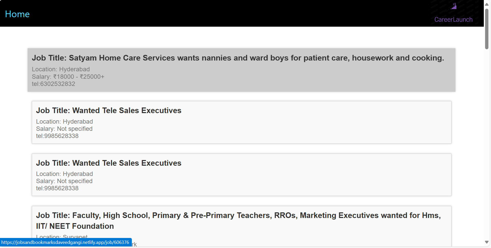
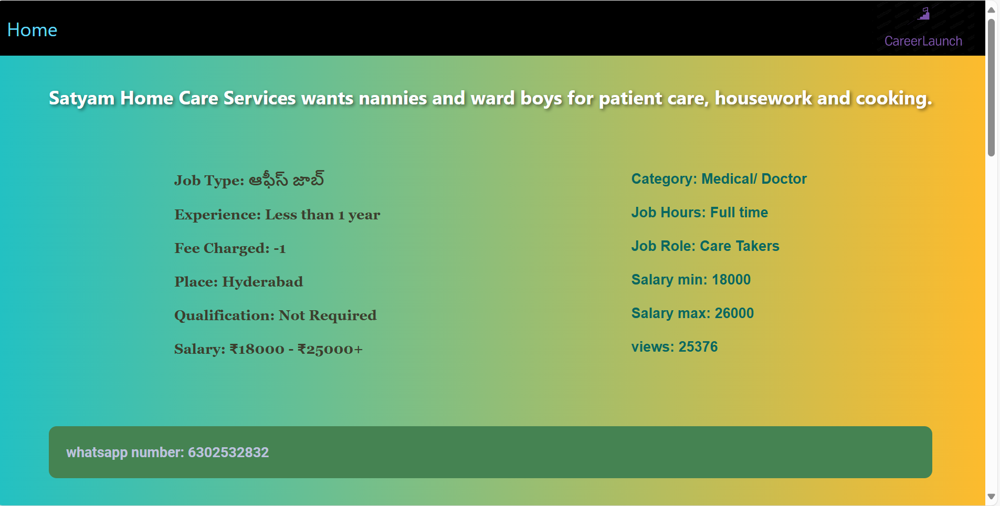
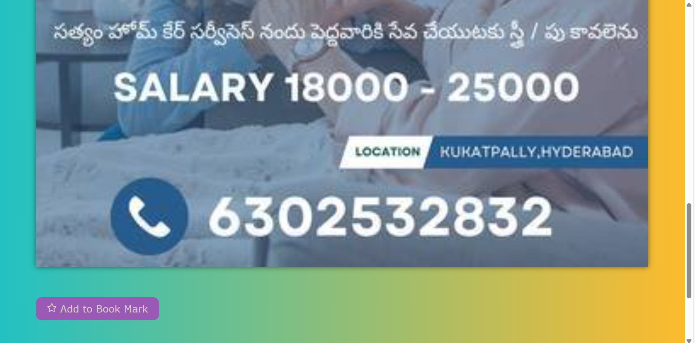
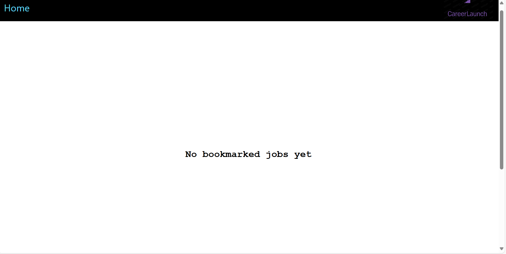
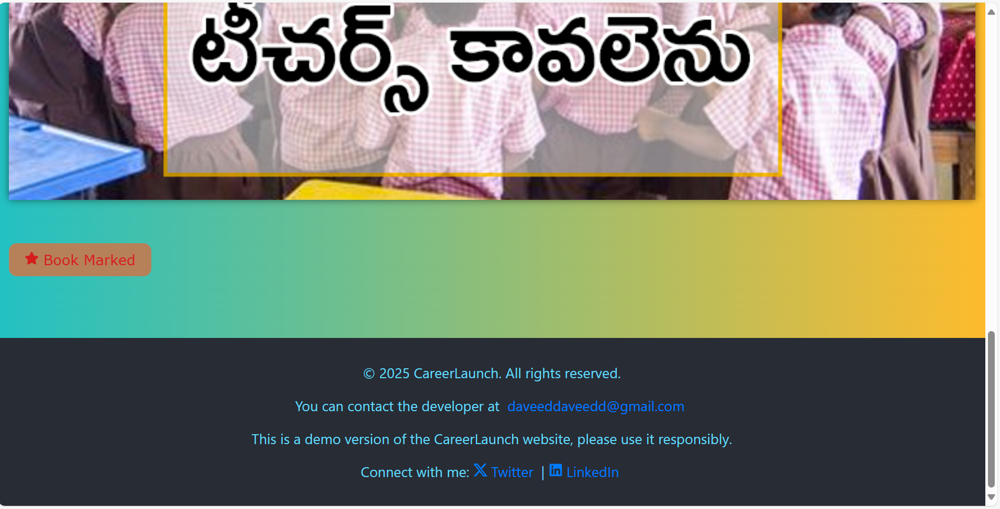
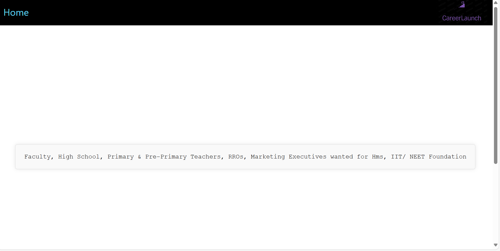

# CareerLaunch 🚀

A React-based web application designed to help users discover and manage job opportunities. CareerLaunch provides a user-friendly interface for browsing job listings, bookmarking favorite jobs, and staying updated on new opportunities. It solves the problem of scattered job searching by centralizing the process and offering personalized features.

## 🌟 Key Features

- **Browse Job Listings:** Explore a comprehensive list of available job opportunities.
- **Bookmark Jobs:** Save your favorite jobs for later viewing and application.
- **Detailed Job View:** Access detailed information about each job posting.
- **Infinite Scrolling:** Seamlessly load more jobs as you scroll, providing an uninterrupted browsing experience.
- **Responsive Design:** Enjoy a consistent experience across various devices.
- **Progressive Web App (PWA) Support:** Install the application on your device for a native-like experience.

## 🛠️ Tech Stack

- **Frontend:**
    - React: JavaScript library for building user interfaces.
    - React Router DOM: For handling client-side routing and navigation.
    - React Icons: For incorporating icons into the user interface.
    - React Loader Spinner: For displaying loading animations.
- **Languages:**
    - JavaScript (ES6+): The primary language for building the application logic.
    - HTML: For structuring the web pages.
    - CSS: For styling the application.
- **Other:**
    - Local Storage: Used for storing bookmarked jobs.
    - APIs: Fetches job data from external APIs.
    - PWA: Progressive Web App features enabled via `manifest.json`.

## 📦 Getting Started

Follow these steps to set up and run the CareerLaunch application locally.

### Prerequisites

- Node.js (version 12 or higher)
- npm or yarn

### Installation

1.  Clone the repository:

    ```bash
    git clone <repository-url>
    cd <repository-directory>
    ```

2.  Install the dependencies:

    ```bash
    npm install # or yarn install
    ```

### Running Locally

1.  Start the development server:

    ```bash
    npm start # or yarn start
    ```

2.  Open your browser and navigate to `http://localhost:3000` to view the application.

## 💻 Usage

- **Home Page:** The landing page provides a brief overview of the application and navigation links to the Jobs and Bookmarks pages.
- **Jobs Page:** Browse the list of job postings. Use the infinite scrolling feature to load more jobs as you scroll down. Click on a job to view its details.
- **Job Details Page:** View detailed information about a specific job. Add or remove the job from your bookmarks using the star icon.
- **Bookmarks Page:** View the list of jobs that you have bookmarked.

## 📂 Project Structure

```
careerlaunch/
├── public/
│   ├── index.html          # Main HTML template
│   ├── manifest.json       # PWA configuration
│   └── ...
├── src/
│   ├── App.js              # Main application component
│   ├── index.js            # Entry point of the React application
│   ├── App.css             # Global CSS styles
│   ├── index.css           # Global CSS styles
│   ├── components/
│   │   ├── home/
│   │   │   ├── index.js      # Home component
│   │   │   └── index.css     # Home component styles
│   │   ├── jobsfolder/
│   │   │   ├── index.js      # AllJobs component
│   │   │   └── index.css     # AllJobs component styles
│   │   ├── job/
│   │   │   ├── index.js      # Job component
│   │   │   └── index.css     # Job component styles
│   │   ├── bookmarks/
│   │   │   ├── index.js      # BookMark component
│   │   │   └── index.css     # BookMark component styles
│   │   └── ...
├── package.json          # Project dependencies and scripts
├── README.md             # Project documentation
└── ...
```

## 📸 Screenshots














## 🤝 Contributing

Contributions are welcome! Please follow these steps:

1.  Fork the repository.
2.  Create a new branch for your feature or bug fix.
3.  Make your changes and commit them with descriptive messages.
4.  Push your changes to your fork.
5.  Submit a pull request.


## 📬 Contact

If you have any questions or suggestions, feel free to contact us at [daveeddaveedd@gmail.com](mailto:daveeddaveedd@gmail.com).

## 💖 Thanks Message

Thank you for checking out CareerLaunch! We hope this application helps you in your job search journey. Your feedback and contributions are highly appreciated!

